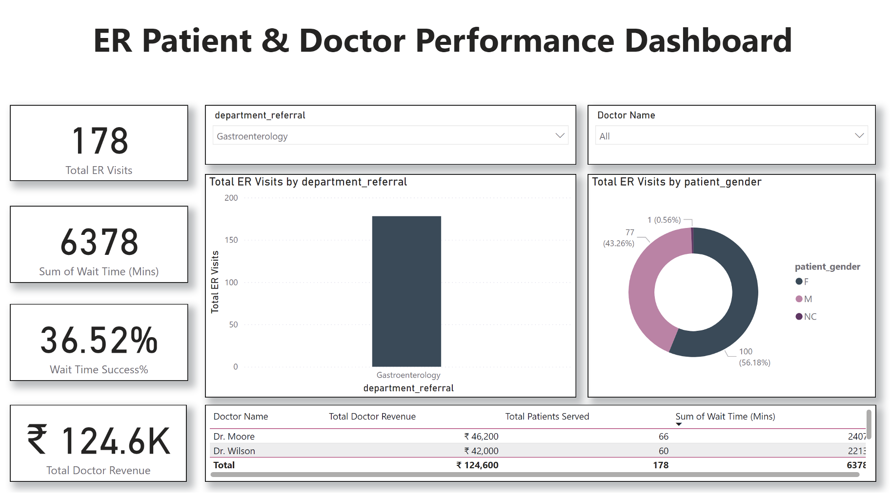

## 📘 Project Overview


The **ER Patient Flow & Doctor Performance Dashboard** is a Power BI project built using two datasets — `Hospital ER.csv` and `Doctor_Patients_data.xlsx`. It provides a comprehensive analytical overview of **Emergency Room operations** and **Doctor performance**, empowering healthcare administrators to make data-driven decisions about patient management, wait time efficiency, and revenue performance.

This documentation details every phase of the project — from data cleaning and modeling to DAX creation, visualization, and validation — offering a complete end-to-end Power BI workflow reference.

---

## 🎯 Project Objectives

* Analyze ER patient flow and department-level performance.
* Track average waiting times and identify efficiency gaps.
* Measure doctor revenue and patient load for performance benchmarking.
* Evaluate hospital-wide wait time success rate (≤30 minutes).
* Deliver an interactive Power BI dashboard that supports filtering by department and doctor.

---

## 🗂️ Files Used

| File Name                                 | Description                                                                                                  |
| ----------------------------------------- | ------------------------------------------------------------------------------------------------------------ |
| `Hospital ER.csv`                         | Contains ER visit-level details including patient ID, wait time (mins), gender, and department referral.     |
| `Doctor_Patients_data.xlsx`               | Contains doctor and patient mapping details, including doctor fees, patient IDs, and department information. |
| `AR_ER_Doctor_Performance_Dashboard.pbix` | Main Power BI file containing the data model, measures, and visuals.                                         |
| `ER_Doctor_Performance_Dashboard-2.pdf`   | Exported static version of the final dashboard for quick reference or portfolio display.                     |

---

## 🧩 Data Model: Star Schema Design

The dashboard is structured around a **Star Schema** model for optimized querying and scalability.

### Tables

* **ER_Data (Fact Table):** Contains patient-level ER data.
* **Doctor_Data (Fact Table):** Contains doctor and consultation-level data.
* **Dim_Department (Dimension Table):** Centralized reference of department names.

### Relationships

* `Dim_Department[department_referral]` → `ER_Data[department_referral]` (1:Many)
* `Dim_Department[department_referral]` → `Doctor_Data[department_referral]` (1:Many)

---

## ⚙️ Data Cleaning and ETL Steps

All transformations were performed in **Power Query Editor**.

1. **Load Data:** Imported both CSV and Excel sources into Power BI.
2. **Ensure Correct Data Types:** Converted numeric and text fields appropriately (e.g., `Wait Time (Mins)` as Number, `Doctor Fee` as Decimal).
3. **Department Name Standardization:**

   * Applied `Transform → Format → Clean` to remove hidden characters.
   * Applied `Transform → Format → Trim` to remove trailing spaces.
   * Applied `Transform → Format → Capitalize Each Word` for consistency.
4. **Created Department Dimension Table:**

   ```DAX
   Dim_Department = DISTINCT('Doctor_Data'[department_referral])
   ```
5. **Established Relationships:** Connected the dimension to both fact tables via `department_referral`.

---

## 🧮 DAX Measures (Correct and Explained)

### ER_Data Table

**1. Total ER Visits**
Counts total visit records.

```DAX
Total ER Visits = COUNTROWS('ER_Data')
```

**2. Avg Wait Time (Mins)**
Calculates average waiting time per patient.

```DAX
Avg Wait Time (Mins) = AVERAGE('ER_Data'[Wait Time (Mins)])
```

**3. Wait Time Success %**
Determines the percentage of ER visits with waiting time ≤ 30 minutes.

```DAX
Wait Time Success % =
VAR TotalVisits = COUNTROWS('ER_Data')
VAR SuccessfulVisits = CALCULATE(
    COUNTROWS('ER_Data'),
    'ER_Data'[Wait Time (Mins)] <= 30
)
RETURN
DIVIDE(SuccessfulVisits, TotalVisits, 0)
```

### Doctor_Data Table

**4. Total Doctor Revenue**
Calculates overall revenue from all doctors.

```DAX
Total Doctor Revenue = SUM('Doctor_Data'[Doctor Fee])
```

**5. Total Patients Served**
Counts the number of unique patients handled by each doctor.

```DAX
Total Patients Served = DISTINCTCOUNT('Doctor_Data'[patient_id])
```

---

## ✅ Step-by-Step: Creating DAX Measures in Power BI

1. Go to **Report View** (chart icon on the left pane).
2. In the **Fields** panel, right-click the target table (ER_Data or Doctor_Data) → **New Measure**.
3. Paste the desired DAX formula.
4. Press **Enter**.
5. Format the measure using **Measure Tools** (Percentage, Currency, or Decimal).
6. If an error appears under column names, copy the exact field name from **Data View** and replace it in the DAX formula.

---

## 📊 Dashboard Layout

### Dashboard Title

> **ER Patient & Doctor Performance Dashboard**

### Visual Components

| Element      | Type                   | Description                                                                                      |
| ------------ | ---------------------- | ------------------------------------------------------------------------------------------------ |
| **Card 1**   | KPI Card               | Displays `Total ER Visits`.                                                                      |
| **Card 2**   | KPI Card               | Displays `Avg Wait Time (Mins)`.                                                                 |
| **Card 3**   | KPI Card               | Displays `Wait Time Success %`.                                                                  |
| **Card 4**   | KPI Card               | Displays `Total Doctor Revenue`.                                                                 |
| **Slicer 1** | Dropdown               | Department filter (`department_referral`).                                                       |
| **Slicer 2** | Dropdown               | Doctor name filter.                                                                              |
| **Chart 1**  | Clustered Column Chart | `Total ER Visits` by `department_referral`.                                                      |
| **Chart 2**  | Donut Chart            | `Total ER Visits` by `patient_gender`.                                                           |
| **Table**    | Table Visual           | Columns: `Doctor Name`, `Total Doctor Revenue`, `Total Patients Served`, `Avg Wait Time (Mins)`. |

---


## 🧾 Summary

This Power BI project demonstrates the full analytical lifecycle — data preparation, model design, DAX creation, visualization, validation, and optimization — all derived directly from the provided CSV and Excel datasets.

The **ER Patient Flow & Doctor Performance Dashboard** delivers a robust view of hospital performance, showcasing Power BI’s capabilities in transforming raw operational data into actionable insights.

---

